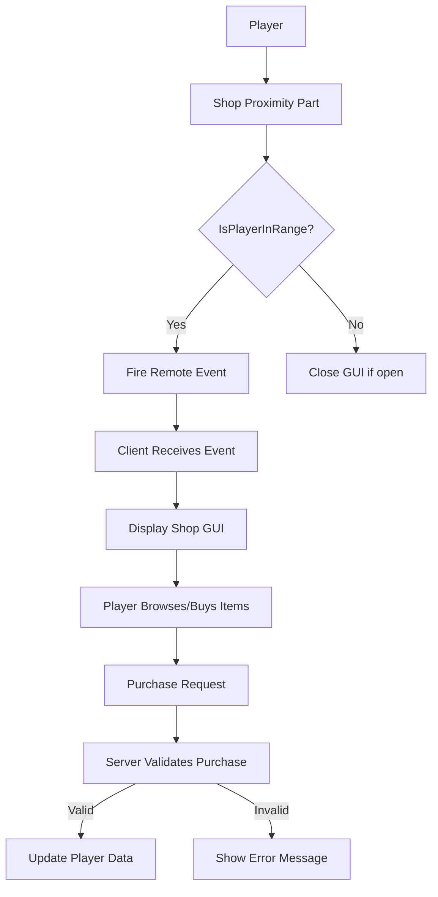

# Shop System Architecture

## System Overview

The shop system consists of three main components:
1. **Proximity Detection**: Detects when a player is near a shop
2. **Shop GUI**: Displays items for purchase
3. **Purchase System**: Handles transactions

## Flow Diagram



## Component Breakdown

### Server-side (.server.ts)
- **Shop Service**: Manages shop data, inventory, and prices
- **Proximity Detector**: Tracks players entering/leaving the shop area
- **Purchase Handler**: Validates and processes purchases

### Client-side (.client.ts)
- **Shop GUI Controller**: Shows/hides the shop interface
- **Item Display**: Renders available items
- **Purchase Requester**: Sends purchase requests to the server

### Shared (.shared.ts)
- **Shop Item Types**: Defines item structure
- **Remote Events/Functions**: For client-server communication
- **Shop Constants**: Shared configuration values

## Directory Structure
```
/src
  /client
    - ShopController.client.ts
    - ShopGUI.client.ts
  /server
    - ShopService.server.ts
    - ProximityDetector.server.ts
  /shared
    - ShopTypes.shared.ts
    - RemoteEvents.shared.ts
```

## Implementation Steps
1. Create proximity detection using a cylinder part
2. Set up remote events for communication
3. Build the shop GUI interface
4. Implement shop inventory and pricing system
5. Create purchase validation and processing
6. Connect to currency/inventory systems
